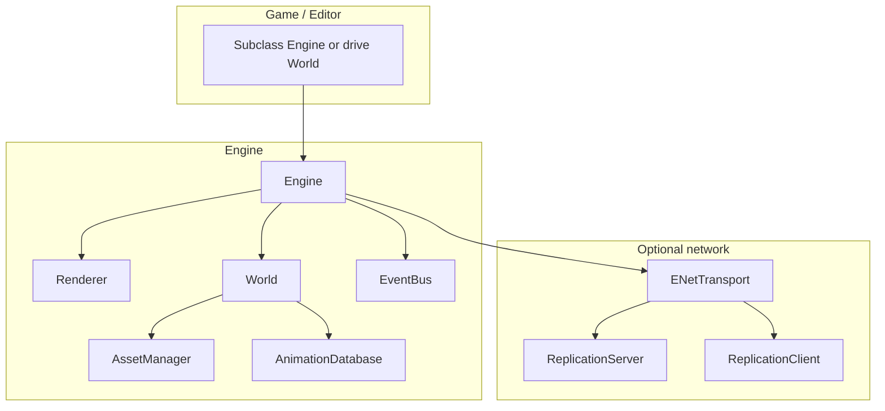

# Criogenio Engine — Capabilities & Architecture

This document describes the **`engine/`** static library: what it provides, how pieces fit together, and where to look in code. For the wider **campsur** repo (editor, sample games, build layout), see the root [ARCHITECTURE.md](../ARCHITECTURE.md).

---

## 1. Role & stack

The engine is a **C++23** module for **2D-first** games (with hooks for **3D / first-person** experiments). It is **not** a full commercial engine; it favors a small ECS, explicit systems, and readable code paths.

| Layer | Technology |
|--------|------------|
| Window, GL context, 2D drawing | **SDL3** |
| 2D rasterization | **OpenGL** (via SDL renderer paths in `render.cpp`) |
| ECS | Custom **sparse-set** registry (`ecs_core.h`, `ecs_registry.h`) |
| Networking | **ENet** (`enet_transport`, `replication_*`) |
| JSON | **nlohmann/json** |
| Physics (linked for engine lib) | **Box2D v3** (C API) — used where projects need it |

**Textures** are loaded through `Renderer::LoadTexture` and wrapped as `TextureResource` in `AssetManager` (not Raylib; older docs may still mention Raylib in places).

---

## 2. High-level architecture



- **`Engine`**: Owns `Renderer`, `World`, `EventBus`; optional ENet transport + replication; runs the main loop (`Run()`).
- **`World`**: ECS facade — entities, components, `ISystem` list, **optional `Terrain2D`**, cameras, `Serialize` / `Deserialize`.
- **`Renderer`**: Frame lifecycle, 2D camera, textures, primitives, text, render targets (used by the editor scene view).

---

## 3. Main loop (actual order)

From `engine.cpp` `Engine::Run()`:

1. **`ProcessEvents`**
2. **`OnFrame(dt)`** — game override: input, `SendInputAsClient` / `SetServerPlayerInput`, etc.
3. **Client only:** `transport->Update()`, poll messages, **`ApplySnapshot`** for each snapshot (before simulation so camera/systems see new transforms).
4. **`world->Update(dt)`** — every registered system’s `Update`.
5. **Server:** `transport->Update()`, **`replicationServer->Update()`** (input, build/send snapshots).
6. **Client:** **`replicationClient->UpdateInterpolation(dt)`** after world update.
7. **`BeginFrame` → `world->Render` → `OnGUI` → `EndFrame`**
8. **`Input::EndFrame`**

Rendering draws **terrain first** (if any), then each system’s `Render` in registration order (`world.cpp`).

---

## 4. ECS

### 4.1 Concepts

- **`EntityId`**: Stable integer handle; **`EntityManager`** tracks alive entities.
- **`Registry`**: For each component type, a **sparse set** maps entity → dense index for cache-friendly iteration.
- **Queries**: `World::GetEntitiesWith<T, U, ...>()` returns entities that have all listed components.

### 4.2 Registration

- **`ComponentFactory`**: String name → add component on entity (used by editor / JSON spawn).
- **`Engine::RegisterCoreComponents()`**: Registers a core set of factory entries (`Transform`, `AnimatedSprite`, `Controller`, `Camera`, `NetReplicated`, 3D types, etc.). Additional gameplay components may be registered by the game or editor.

### 4.3 Components (summary)

Defined mainly in **`components.h`** and **`animated_component.h`**:

| Area | Types |
|------|--------|
| 2D transform | `Transform` |
| 3D | `Transform3D`, `Model3D`, `BoxCollider3D`, `Box3D`, `PlayerController3D`, `Camera3D` |
| Movement / AI | `Controller` (incl. `velocity` for networked movement), `AIController` |
| Animation | `AnimationState`, `AnimatedSprite` |
| Physics / 2D gameplay | `RigidBody`, `BoxCollider`, `Grounded`, `Gravity` (global), `Sprite` |
| Map / editor tags | `LayerMembership` (serialized layer name for editor object layers); **`EditorHidden`** (transient: skip in `SpriteSystem` / `RenderSystem` when an editor hides an object layer) |
| Identity | `Name` |
| Camera | `Camera` (wraps `Camera2D` data) |
| Networking | `NetReplicated`, `ReplicatedNetId` |

---

## 5. Systems (`core_systems.h` / `core_systems.cpp`)

All implement **`ISystem`**: `Update(float dt)`, `Render(Renderer &)`.

| System | Purpose |
|--------|---------|
| `MovementSystem` | Keyboard → `Controller` / `Transform` / `AnimationState` (2D) |
| `MovementSystem3D` | 3D movement path |
| `AIMovementSystem` | `AIController` → target entity |
| `AnimationSystem` | `AnimatedSprite` + `AnimationState` → clip/frame |
| `SpriteSystem` | Renders `Sprite` + `Transform` (skips entities with `EditorHidden`) |
| `RenderSystem` | Renders `AnimatedSprite` + `Transform` via `AnimationDatabase` (skips `EditorHidden`) |
| `GravitySystem` | `RigidBody` + `Gravity` |
| `CollisionSystem` | `RigidBody` + `BoxCollider` vs static colliders and **terrain layer 0** (`CellHasTile`) |

**Order matters**: e.g. gravity before collision; games should register systems in a deliberate order.

### 5.1 Movement extension hooks

`MovementSystem` supports world-scoped callbacks for game-specific movement behavior:

- `SetWorldMovementInputProvider(world, axisFn, runHeldFn, user)` for per-world movement/run input overrides.
- `SetWorldMovementBlockProvider(world, blockFn, user)` for dynamic blockers (for example closed doors in map gameplay).
- `ClearWorldMovementInputProvider(world)` / `ClearWorldMovementBlockProvider(world)` for cleanup on teardown/unload.

The dynamic blocker callback is evaluated per-axis against the same movement footprint used by tile collision (`tile_collision_*`), so gameplay blockers compose with static terrain collision without forking engine movement code.

---

## 6. Rendering & input

### 6.1 `Renderer`

- Window lifecycle, viewport, **2D camera** (`BeginCamera2D` / `EndCamera2D`).
- Drawing: `DrawRect`, `DrawCircle`, `DrawLine`, `DrawTextureRec`, `DrawTexturePro`, **`DrawTextureProFlipped`** (H/V flip for Tiled tile draws), `DrawGrid`, text.
- **Textures**: `LoadTexture`, `UnloadTexture`; **render targets** for off-screen passes (editor).

### 6.2 `Input` / `keys.h`

SDL-backed key and mouse queries (`IsKeyDown`, `IsKeyPressed`, mouse position). **`Input::EndFrame`** clears edge-triggered state at end of frame.

### 6.3 Math helpers

`graphics_types.h`: `Vec2`, `Rect`, `Color`, `Camera2D`, `TextureHandle`, **`ScreenToWorld2D`** / world-to-screen used by camera and editor.

---

## 7. Assets & animation

### 7.1 `AssetManager`

Singleton: register loaders, **`load<T>(path)`** with caching. Typical type: **`TextureResource`** (path + `TextureHandle` + renderer pointer for cleanup).

### 7.2 `AnimationDatabase`

Singleton: **`AnimationDef`** (texture path, clips), **`AnimationClip`** (frames, timing). **`AnimatedSprite`** references an **`AssetId`** and clip name; **`AnimationSystem`** advances frames.

---

## 8. Terrain (`terrain.h`, `terrain.cpp`, `terrain_loader.h`, `tmx_loader.cpp`)

### 8.1 `Terrain2D`

- **Chunked storage**: layers are maps of `(chunkX, chunkY) → tile array` of size `chunkSize²` (default 16).
- **Legacy mode**: tile values are **atlas indices**; empty = **`-1`**.
- **TMX / GID mode**: after `LoadFromTMX`, layer cells store the **full 32-bit Tiled GID** (low 29 bits = global tile id; high bits = H/V/D **flip flags**). Values may be **negative** when interpreted as `int` because the H-flip bit sets the sign—use **`TileGid()`** / **`TileFlipH`** / **`TileFlipV`** / **`TileFlipD`** in `terrain.h` when decoding. Empty cell = **`0`**. **`CellHasTile`** uses **`TileGid(v) != 0`** in GID mode so flipped tiles are not treated as empty.
- **Multi-tileset**: **`tmxTilesets`** (`TmxTilesetEntry`: `firstGid`, `Tileset`, margin, spacing, pixel tile size, optional **`tileProperties`** map: local tile id → list of `TmxProperty` from `<tile id="N"><properties>…</properties></tile>` in TSX / inline tilesets). Rendering picks atlas + UV per GID; flipped tiles use **`DrawTextureProFlipped`** for **horizontal and vertical** mirror; **diagonal (rotate)** bit is stored but not yet visualized in the same path.
- **Layer metadata**: `tmxMeta.layerInfo[]` carries per-tile-layer **`visible`**, **`opacity`**, names, etc.; these round-trip through the level JSON (`level_metadata_json.cpp`).
- **API**: `GetTile`, `SetTile`, `CellHasTile`, `FillLayer`, layer add/remove/move/duplicate, `GetVisibleTileRange`, `Serialize` / `Deserialize`; level save also stores multi-tileset entries and tile property maps when present.

### 8.2 Loading maps

| Loader | Format |
|--------|--------|
| **`TilemapLoader::LoadFromJSON`** | JSON shaped like a Tiled export: `tilewidth`, `tilesets[0].image`, `layers[]` with `data` (indices adjusted −1 in loader). |
| **`TilemapLoader::LoadFromTMX`** | **TMX XML**: orthogonal, non-infinite, **CSV** `<data>`, external `.tsx` or inline tilesets, multiple `firstgid` ranges. **Flip bits preserved** in stored cell values; **no** zlib/base64 tile layers yet. |

### 8.3 World integration

- **`World::CreateTerrain2D`** — procedural placeholder terrain.
- **`World::SetTerrain(std::unique_ptr<Terrain2D>)`** — adopt a loaded map (e.g. from `LoadFromTMX`).
- **`World::Render`** calls **`terrain->Render`** before systems.

---

## 9. Serialization

- **`serialization.h`**: `SerializedComponent`, `SerializedEntity`, **`SerializedWorld`** (entities + **`SerializedTerrain2D`** + animations + optional **`SerializedLevelMetadata`** / `level` block in saved scenes).
- **`json_serialization.cpp`**: World ↔ JSON for editor / level files (`.campsurlevel`, `.json`).
- **`level_metadata_json.cpp`**: Read/write the embedded **`level`** object (metadata, tilesets with **per-tile properties**, layer visibility/opacity, object groups, etc.).
- Components implement **`Serialize` / `Deserialize`** into field maps. Notable: **`Sprite`** includes **`atlasPath`** so textures reload after save; **`World::Serialize`** includes **`LayerMembership`** (and omits transient **`EditorHidden`**).

---

## 10. Networking

- **`INetworkTransport`**: server/client, send/receive, connection IDs.
- **`ENetTransport`**: UDP + reliable/unreliable channels.
- **`ReplicationServer`**: spawns per-connection entities, applies **`PlayerInput`**, builds **`Snapshot`**, sends to clients.
- **`ReplicationClient`**: applies snapshots to local **`World`**; interpolation step after update.
- **Messages**: see **`net_messages.h`** (`MsgType`, **`PlayerInput`**, snapshot packing).

Games must drive input each frame on client/server as described in the root architecture doc.

---

## 11. Events

**`EventBus`** (`event.h`): subscribe/emit by type (e.g. entity lifecycle, input, collision hooks — see `EventType` in header).

---

## 12. 3D / first-person extras (`box3d/`)

- **`FPCamera`**, **`BoxFPSScene`**, **`GLBoxRenderer`**: experimental first-person / box world rendering paths used by **`box_fps`**-style projects.
- **`World`** supports **`AttachCamera3D`**, **`GetActiveCamera3D`**, and 3D-related components.

---

## 13. I/O & tooling hooks

- **`criogenio_io.h` / `criogenio_io.cpp`**: helpers for reading/writing project files (levels, assets) where the editor integrates with the engine.

---

## 14. File layout (engine)

```
engine/
├── ARCHITECTURE.md          ← this file
├── premake5.lua             # static lib, SDL3, ENet, Box2D
├── include/
│   ├── engine.h, world.h, render.h, input.h, keys.h
│   ├── components.h, animated_component.h, core_systems.h, systems.h
│   ├── ecs_core.h, ecs_registry.h, entity.h
│   ├── asset_manager.h, resources.h, animation_*.h
│   ├── terrain.h, terrain_loader.h, serialization.h, json_serialization.h, level_metadata_json.h
│   ├── object_layer.h, map_authoring_components.h, tmx_metadata.h
│   ├── component_factory.h, event.h, criogenio_io.h, log.h
│   ├── network/*.h
│   └── box3d/*.h
└── src/
    ├── engine.cpp, world.cpp, render.cpp, input.cpp, core_systems.cpp
    ├── terrain.cpp, terrain_loader.cpp, tmx_loader.cpp
    ├── asset_manager.cpp, animation_*.cpp
    ├── json_serialization.cpp, level_metadata_json.cpp, map_authoring_components.cpp
    └── network/*.cpp, box3d/*.cpp
```

---

## 15. Building & linking

- The repo uses **Premake**; **`engine`** is a **static library** (`libengine.a` / `.lib`).
- Consumer projects **`link_to("engine")`** (see `premake5.lua` helpers), link **ENet**, **SDL3**, **OpenGL**, **Box2D** as configured in `engine/premake5.lua`.
- After adding new `.cpp` files under `engine/src/`, regenerate: **`premake5 gmake`** (or `vs2022`, etc.).

---

## 16. Extension points (quick reference)

1. **New component**: inherit `Component`, implement serialization, register with **`ComponentFactory`** and ensure **`World::Deserialize`** / spawn paths know the type if needed.
2. **New system**: inherit `ISystem`, register with **`World::AddSystem<T>(...)`** in the order you need.
3. **New resource**: implement `Resource`, register a loader on **`AssetManager`**.
4. **Custom transport**: implement **`INetworkTransport`** (advanced; replication expects certain message shapes).

---

## 17. Related docs

- [../ARCHITECTURE.md](../ARCHITECTURE.md) — broader campsur narrative (some sections predate SDL3/TMX; prefer this file for **engine** facts).
- **ENGINE_IMPROVEMENTS.md**, **TODO.md** — roadmap and ideas, if present at repo root.
