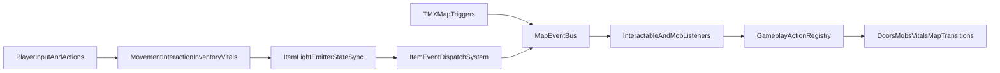

# Subterra Guild Gameplay Mechanics

This document is the gameplay reference for `subterra_guild`. It explains mechanics as currently implemented in code and data files.

For engine internals, see [`../engine/ARCHITECTURE.md`](../engine/ARCHITECTURE.md).  
For repo-wide architecture context, see [`../ARCHITECTURE.md`](../ARCHITECTURE.md).

## Scope and Audience

- **Designers and content authors:** how maps, prefabs, and triggers behave in play; what JSON to edit; how to validate with debug commands.
- **Developers:** high-level wiring between systems; this is not a substitute for engine ECS/network docs (see links above).

---

## Core Gameplay Loop

- Explore TMX maps and move with player controller + camera follow.
- Interact with nearby pickups and interactables (`E`).
- Manage active item slot/equipment and use consumables (`U`).
- Trigger map/gameplay events from triggers, light overlaps, and scripted actions.
- Survive via vitals (health/stamina/food) and status effects while progressing through teleports/events.

---

## Player Systems

### Movement, Bounds, Collision

- Player movement is handled by `MovementSystem` with Subterra input bindings.
- Tile collision uses a narrow foot-body footprint (`tile_collision_*`) for top-down feel.
- `MapBoundsSystem` clamps player position to terrain/fallback bounds.
- Closed doors can block movement through the engine movement blocker hook.

### Interaction Radius

- Pickup radius: ~`64` px from player center to pickup rect center.
- Interactable use radius: ~`44` px to nearest interactable center.
- Closest valid target wins each frame for hints and `E` actions.

---

## Items, Inventory, and Loadout

### Inventory and Slots

- Player uses `Inventory` + `SubterraLoadout`.
- Action bar has `5` slots (`1..5` selects active slot).
- Equipment has `3` slots (weapon/offhand/body style usage via item catalog + loadout helpers).
- Invalid action slot refs are sanitized when item quantity disappears.

### Pickup and Drop Lifecycle

- World drops are `WorldPickup` entities.
- Picking up transfers count to inventory and may delete the world entity (or reduce stack).
- Remaining stack in world continues to exist and keeps its own gameplay state.

### Consumables

- `U` uses the active action slot item.
- If item is consumable by JSON/catalog rules, it removes one item and applies configured recovery values.

---

## Light Mechanics

### Holder-Bound Emitter Lifecycle

- Items with `light_emission` in `entities_items.json` are resolved into runtime emitter state.
- Runtime source of truth is `ItemLightEmitterState` on holder entities:
  - inventory/loadout holders (`Inventory + SubterraLoadout + Transform`)
  - world pickups (`WorldPickup + Transform`)
- Sync is done by `ItemLightSyncSystem` each frame.

### Visual Emission Rules

- Item emitters are rendered from holder entity position.
- Item emission is always-on for enabled emitters (no day/night suppression for item lights).
- World light disappears immediately when emitting pickup entities are removed.

### Map/Event Emission Coupling

- `ItemEventDispatchSystem` reads the same emitter component state used by rendering.
- This prevents desync between “visible light” and “event-dispatch light”.

### Map-Baked Lights (Atmosphere)

- TMX-derived static lights (windows, torches, etc.) are drawn in the day/night atmosphere pass and are separate from item emitters.
- Their intensity can vary with day phase and outdoor/roof blending; item lights do not use that same suppression path.

---

## Event-Driven Gameplay

### Event Bus and Payloads

- Subterra gameplay uses `MapEventBus`.
- Events carry `MapEventPayload` including optional JSON `event_data`.
- Sources include:
  - TMX trigger overlap (`MapEventSystem`)
  - item overlap dispatch (`ItemEventDispatchSystem`)
  - manual/debug emits (`emit`, `emitdata`, `emitlight`)

### Listener Evaluation

- Interactable listeners come from `entities_interactable.json`.
- Mob listeners come from `entities_mobs.json`.
- `required_data` is matched as subset against payload `event_data`.

### Action Execution

- Matching listeners execute actions via `GameplayActionRegistry`.
- Actions drive gameplay effects (unlock/toggle states, attacks, camera notifications, teleports, wave spawns, etc.).

---

## Interactables and Doors

### Built-In Interactable Behaviors

- `door`: toggles open/close unless locked.
- `chest`: toggles open/close unless locked.
- `campfire`: toggles burning.
- `lever`: can target door via Tiled `opens_door`.
- `bed`: currently logs behavior; no deep rest pipeline yet.

### Door Hard Collision and Teleport Guard

- Closed doors are treated as dynamic blockers in movement.
- Teleport-like trigger enter is skipped when trigger rect overlaps a closed door rect.
- Opening/unlocking door immediately updates traversability.

---

## Mobs and AI

- Mobs are data-driven from `entities_mobs.json`.
- TMX spawn prefabs can resolve to mob prefabs.
- Runtime stores mob prefab id + mutable mob entity data in session maps.
- Brains execute before AI movement (`MobBrainSystem` then `AIMovementSystem`).
- Example behavior families include patrol/chase patterns; listeners can react to events like light overlap.

---

## Vitals and Status Effects

- `PlayerVitals`: health, stamina, food_satiety, dead/sprint-lock behavior.
- Food drives stamina ceiling; starvation can disable recovery and apply damage-over-time.
- Campfires/rest areas can affect regen behavior when configured.
- Status effects (buffers/debuffers) load from JSON and apply timed modifiers/flags.

---

## Map Triggers and Progression

- TMX objects become triggers with event metadata.
- Trigger dispatch is edge-based (on enter).
- Default flow supports gameplay action lists, teleports, and spawn-wave patterns.
- Runtime triggers can be added/cleared for testing and scripted sequences.

---

## Mechanics Data Authoring Index

### Prefab Data

- `subterra_guild/data/prefabs/entities_items.json`
  - item definitions, `light_emission`, `event_dispatch`
- `subterra_guild/data/prefabs/entities_interactable.json`
  - interactable defaults, `entity_data`, `event_listeners`
- `subterra_guild/data/prefabs/entities_mobs.json`
  - mob visuals, default state, listeners, `brain_type`

### Rules/Effects Data

- `subterra_guild/data/server_configuration/world_config.json`
  - world/vitals/camera/global tuning
- `subterra_guild/data/effects/buffers.json`
- `subterra_guild/data/effects/debuffers.json`

---

## Runtime Debug Checklist

### Door Collision + Teleport

- Put a closed door in front of a passage/teleport area.
- Expect player movement to stop at door footprint.
- Open/unlock door and re-test movement.
- Expect movement through passage + teleport trigger to work when door is open.

### Item Light Lifecycle

- Spawn or drop an item with `light_emission` (for example `energy_torch`).
- Expect world pickup to emit from pickup location.
- Pick it up.
- Expect world light to disappear and holder-based light to continue.
- Drop it again.
- Expect emission to move back to world pickup holder.

### Useful Commands

- `istate <tiled_object_id>`: inspect interactable runtime `entity_data`.
- `mstate [entity_id]`: inspect mob runtime state.
- `emitdata <trigger> <json_object>`: dispatch event payload with custom data.
- `emitlight <event> [r g b] [radius] [intensity]`: simulate light-driven payloads.
- `itempairs`: inspect active item overlap pair tracking.

---

## Mechanics Flow

---

## Implementation Reference (Source of Truth)

- `subterra_guild/src/main.cpp` — system registration order
- `subterra_guild/src/game.cpp` — pickups, interact hints, action bar, consumable use, tile footprint
- `subterra_guild/src/map_events.cpp` — triggers, interactable use, listener helpers
- `subterra_guild/src/map_event_system.cpp` — trigger overlap, teleport guard vs closed doors
- `subterra_guild/src/subterra_gameplay_actions.cpp` — default map event handling, registered actions
- `subterra_guild/src/subterra_item_light_runtime.cpp` — `ItemLightEmitterState` sync
- `subterra_guild/src/subterra_item_event_dispatch.cpp` — light overlap → `MapEventBus`
- `subterra_guild/src/subterra_day_night.cpp` — atmosphere, map lights, item light draw
- `subterra_guild/src/subterra_vitals_tick.cpp` — vitals/status tick rules
- `subterra_guild/src/subterra_console_commands.cpp` — debug commands and movement hooks

---

## Known Caveats

- Bed interaction is currently minimal (log-level behavior).
- Lever-to-door requires correct Tiled `opens_door` object id wiring.
- Carried emitter selection is derived from active action slot + equipment state on holder entities.
- Some systems are data-driven and rely on valid JSON shape; malformed data may no-op with warnings.
